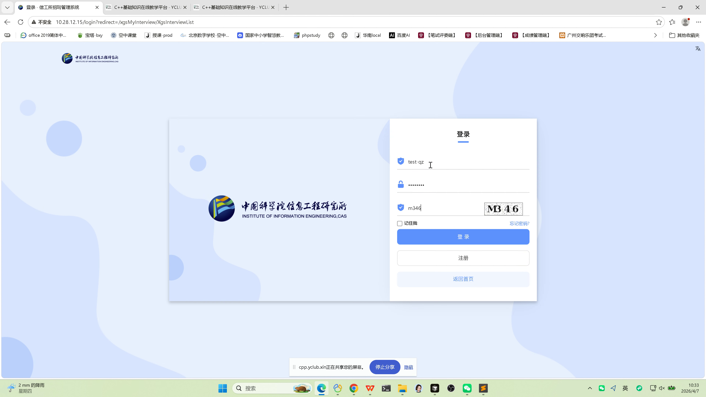
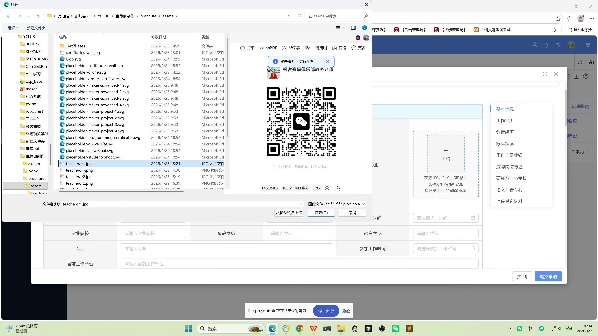

# 求职者操作手册

## 文档信息

| 项目 | 说明 |
|------|------|
| 文档版本 | 1.1（图文并茂） |
| 适用角色 | **求职者**（应聘账号） |
| 主要目标 | 浏览岗位、注册/登录、投递简历、查询申请与面试状态 |
| 配图来源 | 录屏《信工所招聘系统测试录制》截帧，见 `docs/video_frames/` |

---

## 配图说明

下文截图路径相对于 **`docs/standard-manual/`** 目录，与仓库内 **`docs/video_frames/*.png`** 对应；若移动文档位置，请同步调整图片相对路径或重新导出 Word。

---

## 1. 角色说明

求职者使用系统完成：**查看公开招聘信息**、对意向岗位进行**在线申请**（填写简历、上传材料与个人照片）、在**个人中心**跟踪**申请进度**与**面试通知**，并对面试邀请进行**接受或拒绝**。

---

## 2. 系统访问与登录

### 2.1 访问地址

- 打开浏览器，访问单位公布的招聘系统地址，例如：**`http://10.28.12.15/`**（以实际部署为准）。

### 2.2 登录与注册

- 使用单位分配的账号登录；若无账号，按页面指引完成**注册**后再登录。
- 登录页通常包含：用户名、密码、**验证码**（若启用）、**记住我**、**登录**、**注册**、**返回首页**。
- 登录成功后，默认进入**后台**（个人工作台）或按系统配置跳转；也可从登录页进入**首页**。

### 2.3 首页与后台切换（通用）

| 步骤 | 操作说明 |
|------|----------|
| 1 | 默认登录后进入**后台** |
| 2 | 点击 **【返回首页】** 可回到**门户/首页** |
| 3 | 点击 **【个人中心】**（或等价入口）可再次进入**后台** |

---

## 3. 浏览招聘岗位并投递

### 3.1 查看招聘信息

| 步骤 | 操作说明 |
|------|----------|
| 1 | 在**首页**进入 **【招聘信息】**（或「招聘公告 / 岗位列表」等同级入口） |
| 2 | 浏览当前**在招岗位**列表 |
| 3 | 可使用 **岗位类型**、**部门类型**、**职位名称**、**部门名称** 等条件缩小范围（以页面实际筛选项为准） |
| 4 | 点击某一岗位，进入**岗位详情**，阅读任职要求与说明 |

### 3.2 在线申请

| 步骤 | 操作说明 |
|------|----------|
| 1 | 在岗位详情页，若该岗位**尚未投递**，可点击 **【在线申请】** |
| 2 | 按页面引导填写**应聘信息**、**简历信息**，并按要求上传**个人照片**及其他材料（格式、大小以页面提示为准，常见为 JPG/PNG 等，有大小限制） |
| 3 | 核对信息后**提交申请** |

**业务规则（重要）：**

- **同一岗位不可重复投递**：已投递过的岗位，系统不允许再次投递。

---

## 4. 查看个人申请信息

| 步骤 | 操作说明 |
|------|----------|
| 1 | 登录并进入**后台** |
| 2 | 打开 **【个人中心】** → **【我的申请】** |
| 3 | 可查看本人全部申请记录 |
| 4 | 点击 **【查看】**，可查看对应申请的**简历信息**与当前 **【申请状态】** |

---

## 5. 查看面试信息与结果

| 步骤 | 操作说明 |
|------|----------|
| 1 | 在**后台**进入 **【个人中心】** → **【我的面试】** |
| 2 | 查看本人收到的**面试邀请**列表 |
| 3 | 可对邀请执行 **【接受邀请】** 或 **【拒绝邀请】** |
| 4 | 在同一入口查看**面试进度**或**面试结果**（是否通过等，以单位规则与页面展示为准） |

---

## 6. 界面与操作提示（参考）

- **简历表单**可能分多模块：基本信息、工作经历、教育经历、家庭状况、业绩与陈述、论文专利、其他材料等，请按顺序完整填写。
- **照片上传**：请使用符合提示的像素与文件大小，避免上传失败。
- 若页面提供 **【关闭】** / **【提交申请】** 等按钮，请在确认信息无误后再提交。

---

## 7. 常见问题提示

| 现象 | 建议处理 |
|------|----------|
| 无法对某岗位再次申请 | 该岗位可能已投递，请至「我的申请」核实 |
| 无法登录 | 核对账号密码、验证码；联系管理员确认账号是否启用 |
| 材料上传失败 | 检查格式、大小与网络；按页面提示重试 |

（完）
