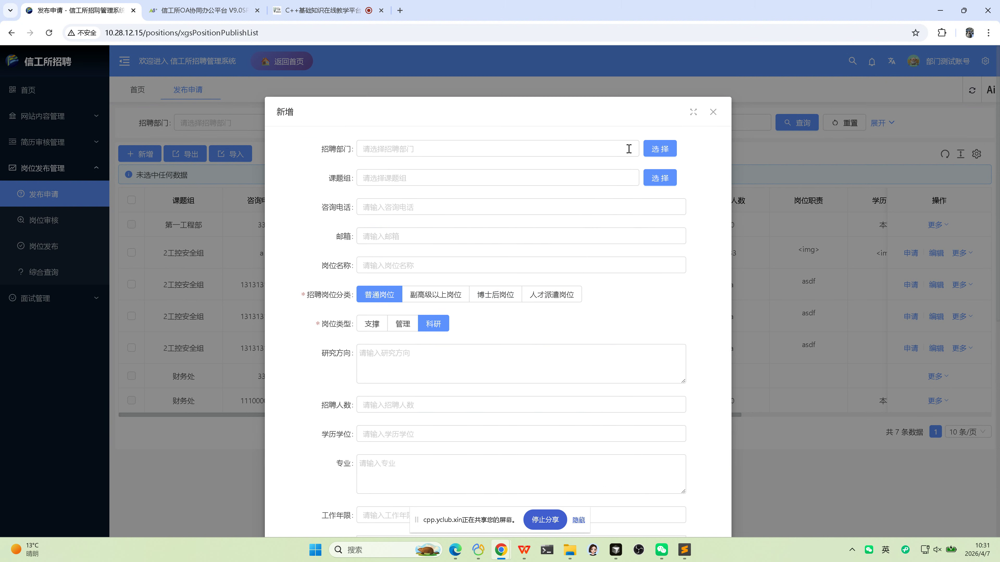

# 部门审核操作手册

## 文档信息

| 项目 | 说明 |
|------|------|
| 文档版本 | 1.1（图文并茂） |
| 适用角色 | **部门管理员** / **部门业务经办**（课题组或部门侧招聘负责人） |
| 主要目标 | 维护本部门招聘岗位的申请与发布流程中的**部门侧**工作；对流转至本部门的**应聘简历**进行审核 |
| 配图来源 | 录屏截帧 `docs/video_frames/frame_001.png` |

---

## 配图说明

截图路径相对于 **`docs/standard-manual/`**，指向 **`../video_frames/`**。

---

## 1. 角色说明

部门侧用户在本系统中通常负责：

1. **岗位发布管理（部门发起）**：创建或维护本部门拟招聘岗位信息，发起**发布申请**，配合人事完成岗位上线。  
2. **部门简历审核**：在人事处完成前置环节后，对进入「部门审核」环节的应聘人员进行**通过**或**驳回**。

具体菜单权限以管理员授权为准。

---

## 2. 系统访问与通用操作

### 2.1 访问与登录

- 访问单位公布的系统地址（例如 **`http://10.28.12.15/`**），使用**部门侧账号**登录后台。

### 2.2 首页与后台切换

| 步骤 | 操作说明 |
|------|----------|
| 1 | 登录后默认进入**后台** |
| 2 | **【返回首页】**：返回门户/首页 |
| 3 | **【个人中心】**：进入个人相关功能或返回后台导航（以实际菜单为准） |

---

## 3. 岗位发布管理（部门侧：发布申请）

> 对应菜单：**【岗位发布管理】**（子项含：**发布申请**、**岗位审核**、**岗位发布**、**综合查询** 等；部门侧重点使用 **发布申请**，后续与人事协同完成审核与发布。）

### 3.1 发布申请

| 步骤 | 操作说明 |
|------|----------|
| 1 | 后台进入 **【岗位发布管理】** → **【发布申请】** |
| 2 | 点击 **【新增】**，在弹出窗口中填写岗位信息（如：招聘部门、课题组、咨询电话、邮箱、岗位名称、岗位分类、岗位类型、研究方向、人数、学历学位、专业、工作年限等，**必填项以页面 `*` 标注为准**） |
| 3 | 保存后可通过 **【编辑】** 继续修改 |
| 4 | 信息确认无误后，点击 **【申请】**，发起**岗位发布审核**流程 |

**参考界面要点（与录屏一致）：**

- 列表支持按条件 **查询 / 重置**，支持 **新增**、导出、导入（以权限为准）。  
- 「新增」表单中 **招聘岗位分类**、**岗位类型** 等可能为选项组，需按实际招聘需求选择。

### 3.2 综合查询（可选）

| 步骤 | 操作说明 |
|------|----------|
| 1 | 进入 **【岗位发布管理】** → **【综合查询】** |
| 2 | 查看本部门或权限范围内**已发起**的岗位记录（状态以列表字段为准） |

> **说明：** **岗位信息审核**（同意/驳回招聘岗位本身）与 **点击发布** 使岗位在「招聘信息」中可见，通常由**人事处**在对应菜单完成；部门需与人事流程对齐。详见《人力处审核操作手册》。

---

## 4. 简历审核（部门审核环节）

> 对应菜单：**【简历审核管理】** → **【部门审核】**

### 4.1 处理流程

| 步骤 | 操作说明 |
|------|----------|
| 1 | 在 **【人力处收集】** 环节中**已通过**的简历，会进入 **【部门审核】** 列表（仅显示权限内数据） |
| 2 | 点击 **【详情】** 查看应聘人员简历与材料 |
| 3 | 点击 **【审核】**，在审核意见中选择 **同意** 或 **驳回** |

### 4.2 业务关系

- **顺序**：应聘人员投递 → **人力处收集**审核 → **部门审核**（本手册）→ **人力处审核**（后续环节，由人事处理）。  
- 部门**驳回**时，请按单位制度填写清晰意见，便于求职者与人事跟进。

---

## 5. 注意事项

| 项目 | 说明 |
|------|------|
| 权限 | 仅能操作被授权的组织范围与菜单；无菜单请联系系统管理员 |
| 数据一致性 | 岗位字段（部门、人数、学历等）应与用人计划一致，避免反复退回 |
| 时效 | 建议在单位规定时限内完成部门审核，以免影响后续人力处与面试安排 |

---

## 6. 常见问题提示

| 现象 | 建议处理 |
|------|----------|
| 看不到「部门审核」数据 | 确认前置「人力处收集」是否已通过；筛选条件是否过窄 |
| 无法新增发布申请 | 检查角色权限与部门数据权限 |
| 找不到「综合查询」记录 | 确认岗位是否已由本部门发起、时间范围与筛选条件 |

（完）
