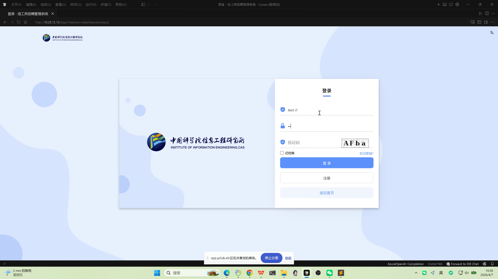
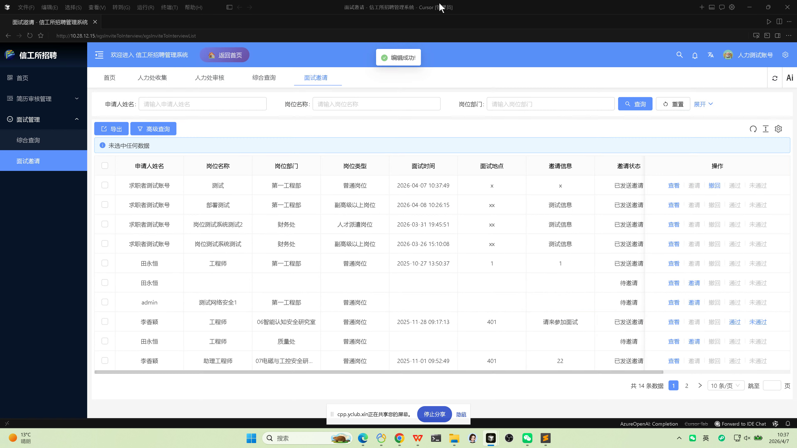

# 人力处审核操作手册

## 文档信息

| 项目 | 说明 |
|------|------|
| 文档版本 | 1.1（图文并茂） |
| 适用角色 | **人事处**（招聘业务管理、人力审核账号） |
| 主要目标 | 岗位发布**审核与上线**；简历**收集与多级审核**中的**人力处环节**；**面试邀请**与**面试结果**维护 |
| 配图来源 | 录屏截帧 `frame_004.png`、`frame_005.png` |

---

## 配图说明

截图路径相对于 **`docs/standard-manual/`**，指向 **`../video_frames/`**。

---

## 1. 角色说明

人力处用户在本系统中通常负责：

1. **岗位全流程**：对待发布的岗位进行**审核**（同意/驳回），对已通过审核的岗位执行**发布**，使求职者在「招聘信息」中可见。  
2. **简历审核链路**：**人力处收集** → 推送 **部门审核** → **人力处审核**（终审或人事复核，以单位制度为准）。  
3. **面试管理**：面试**综合查询**、发出**面试邀请**、面试结束后标记 **通过** / **未通过**。

---

## 2. 系统访问与通用操作

### 2.1 访问与登录

- 访问单位公布的系统地址（例如 **`http://10.28.12.15/`**），使用**人事处账号**登录后台。

### 2.2 首页与后台切换

| 步骤 | 操作说明 |
|------|----------|
| 1 | 登录后默认进入**后台** |
| 2 | **【返回首页】**：返回门户/首页 |
| 3 | **【个人中心】**：进入个人相关功能（以实际菜单为准） |

---

## 3. 岗位发布管理（审核与发布）

> 对应菜单：**【岗位发布管理】** → **【岗位审核】**、**【岗位发布】**、**【综合查询】**

### 3.1 岗位审核

| 步骤 | 操作说明 |
|------|----------|
| 1 | 进入 **【岗位发布管理】** → **【岗位审核】** |
| 2 | 在列表中找到部门已 **【申请】** 的岗位 |
| 3 | 点击 **【详情】**，或通过 **【审核】** 中的 **【岗位信息】** 查看岗位完整信息 |
| 4 | 点击 **【审核】**，在 **【审核意见】** 中选择 **同意** 或 **驳回** |
| 5 | **同意**：流程继续（进入待发布等环节，以系统状态为准）；**驳回**：该岗位发布流程**终止**，部门需修改后重新申请 |

### 3.2 岗位发布（上线）

| 步骤 | 操作说明 |
|------|----------|
| 1 | 进入 **【岗位发布管理】** → **【岗位发布】** |
| 2 | 在列表中查看 **已通过审核、待发布** 的岗位 |
| 3 | 对目标岗位点击 **【发布】**，发布后求职者在首页 **【招聘信息】** 中可见 |

### 3.3 综合查询

| 步骤 | 操作说明 |
|------|----------|
| 1 | 进入 **【岗位发布管理】** → **【综合查询】** |
| 2 | 查看权限范围内**所有已发起**的岗位及状态，便于统计与督办 |

**参考界面（录屏）：** 面试相关列表常含 **查询 / 重置 / 展开**、导出、高级查询及分页。

---

## 4. 简历审核管理（人力处收集与人力处审核）

> 对应菜单：**【简历审核管理】** → **【人力处收集】**、**【部门审核】**、**【人力处审核】**

### 4.1 人力处收集（初审）

| 步骤 | 操作说明 |
|------|----------|
| 1 | 进入 **【简历审核管理】** → **【人力处收集】** |
| 2 | 点击 **【详情】** 查看简历与材料 |
| 3 | 点击 **【审核】**，选择 **同意** 或 **驳回** |

### 4.2 部门审核（监控与协同）

| 步骤 | 操作说明 |
|------|----------|
| 1 | 进入 **【部门审核】**（与部门同事协同同一流程） |
| 2 | **人力处收集** 审核通过的记录会在此展示（供**部门**审核） |
| 3 | 人事可按权限 **查看详情**、跟踪进度；**审核操作主体在部门侧**（参见《部门审核操作手册》） |

### 4.3 人力处审核（复审/终审）

| 步骤 | 操作说明 |
|------|----------|
| 1 | 进入 **【人力处审核】** |
| 2 | **部门审核** 通过的记录会进入本列表 |
| 3 | 点击 **【详情】**、**【审核】**，进行 **同意** 或 **驳回** |

---

## 5. 面试管理（综合查询与面试邀请）

> 对应菜单：**【面试管理】** → **【综合查询】**、**【面试邀请】**

### 5.1 综合查询

| 步骤 | 操作说明 |
|------|----------|
| 1 | 进入 **【面试管理】** → **【综合查询】** |
| 2 | 查看**全部面试相关记录**（含：待邀请、已邀请、面试中、未通过、已通过等状态，以列表字段为准） |

### 5.2 面试邀请

| 步骤 | 操作说明 |
|------|----------|
| 1 | 进入 **【面试管理】** → **【面试邀请】** |
| 2 | 在列表中查看 **待邀请** 等记录；可按 **申请人姓名、岗位名称、岗位部门** 等筛选（以页面为准） |
| 3 | 点击 **【邀请】**，填写 **面试时间**、**面试地点**、**邀请说明** 等信息并发送 |
| 4 | 若需调整，可使用 **【撤回】** 等操作（以页面按钮为准） |

**参考界面（录屏）：** 操作列可能包含 **查看、邀请、撤回、通过、未通过**；**邀请状态** 如「待邀请」「已发送邀请」等。

### 5.3 面试结果

| 步骤 | 操作说明 |
|------|----------|
| 1 | 在面试列表中，待该场面试结束后 |
| 2 | 点击 **【通过】** 或 **【未通过】** 录入面试结果 |

---

## 6. 注意事项

| 项目 | 说明 |
|------|------|
| 流程顺序 | 岗位须 **审核通过 → 发布** 后，求职者方可在前台投递（与前台「在招」状态一致） |
| 简历链路 | 一般顺序为：**人力处收集** → **部门审核** → **人力处审核**，请勿跳环节操作 |
| 面试通知 | 邀请发出后，求职者需在 **【我的面试】** 中接受或拒绝；结果录入应对应同一人同一岗位记录 |

---

## 7. 常见问题提示

| 现象 | 建议处理 |
|------|----------|
| 岗位审核列表为空 | 确认部门是否已点击「申请」；筛选时间与状态 |
| 前台看不到岗位 | 确认是否已在「岗位发布」中点击「发布」 |
| 部门审核已通过但人力处审核无数据 | 核对流程是否被驳回、数据权限与筛选条件 |
| 面试邀请无法发送 | 检查前置审核是否完成、岗位与人员是否匹配 |

（完）
