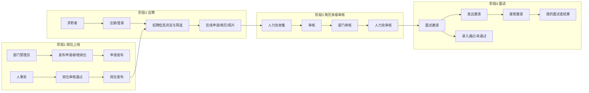

# 信工所招聘管理系统 — 自动化测试方案

> 依据：《信工所招聘管理系统操作手册.docx》、录屏《信工所招聘系统测试录制.webm》、业务方提供的角色与流程说明、仓库内现有 Playwright 配置。

---

## 一、输入材料分析结论

### 1.1 Word 操作手册（已结构化提取）

手册共 13 个内容块，与端到端流程对应关系如下。

| 手册章节 | 要点 | 与自动化测试的映射 |
|---------|------|-------------------|
| 系统登录 | 登录地址 `http://10.28.12.15/` | `E2E_BASE_URL` 可指向内网或本地代理；需区分前台/后台入口 |
| 首页与后台切换 | 默认进后台；【返回首页】【个人中心】 | 用例需显式验证路由切换与权限菜单可见性 |
| 角色/授权、用户、部门（管理员） | 菜单路径在【系统管理】下 | **预置数据策略**：测试环境建议预置角色/用户/部门，E2E 尽量不依赖「首次建库」的长链路 |
| 岗位发布（业务人员） | 【岗位发布管理】→【发布申请】→【申请】→【岗位审核】→【岗位发布】→【综合查询】 | **主链路用例 1**：创建 → 申请 → 审核通过 → 发布 |
| 求职者求职 | 首页【招聘信息】筛选、详情、【在线申请】、不可重复投递 | **主链路用例 2**：浏览 → 申请 → 填简历/照片 |
| 我的申请 | 【个人中心】-【我的申请】 | 断言申请状态流转 |
| 简历审核 | 【人力处收集】→【部门审核】→【人力处审核】 | **主链路用例 3**：三级审核顺序与状态 |
| 面试邀请 | 【面试管理】-【综合查询】/【面试邀请】；邀请、通过/未通过 | **主链路用例 4～6**：邀请 → 应聘者操作 → 结果回写 |
| 我的面试 | 【个人中心】-【我的面试】；接受/拒绝、看结果 | **主链路用例 7** |

### 1.2 录屏视频（技术分析）

| 项目 | 结果 |
|------|------|
| 容器/编码 | WebM（Matroska），视频流 **VP9** |
| 分辨率 | **3840×2160**（4K），约 **29.17 fps** |
| 本机 ffprobe | 报错 `Unsupported codec with id 169`（与工具链版本有关）；`ffmpeg -i` 可识别为 VP9，但 **Duration 显示 N/A**（旧版 ffmpeg 对部分 WebM 元数据不完整） |

**建议（补齐「视频侧」工具链）**

- 在 CI/本机安装 **较新的 FFmpeg（建议 6.x+）**，再执行：  
  `ffprobe -v error -show_entries format=duration -of default=noprint_wrappers=1:nokey=1 录屏.webm`  
  以获取准确时长，便于按时间轴切分场景。
- 若需「按画面」对照手册步骤：可用 **Playwright 自带 video/trace** 复跑用例生成对照录屏；或使用 **Cursor IDE Browser MCP** 做人工抽检（非批量断言）。

---

## 二、测试角色与账号（业务给定）

| 角色 | 账号 | 密码 | 典型职责 |
|------|------|------|----------|
| 求职者 | test-qz | Qz@12345 | 注册/登录前台、浏览岗位、投递、我的申请/我的面试 |
| 部门管理员 | test-bm | Bm@12345 | 岗位发布申请、部门侧简历审核 |
| 人事处管理 | test-rl | Rl@12345 | 岗位审核与发布、人力处收集/人力处审核、面试邀请与面试结论 |
| 系统管理员 | admin | zktw | 用户/角色/部门（预置数据，一般不进主业务 E2E） |

**安全说明**：上述账号仅用于**测试环境**；生产环境禁止写入文档或代码库明文密码，应使用密钥管理或 CI Secret。

---

## 三、端到端业务流程（与手册对齐）



---

## 四、自动化测试范围与用例分层

### 4.1 建议分层

| 层级 | 内容 | 工具倾向 |
|------|------|----------|
| **E2E（端到端）** | 单条「全流程」+ 若干条角色视角关键路径 | **Playwright**（项目已配置 `jeecgboot-vue3/playwright.config.ts`，已有示例 `tests/e2e/resume-submit.spec.ts`） |
| **API**（可选） | 状态机强相关接口：审核、发布、面试状态 | JUnit / RestAssured（后端）或 Playwright `request` |
| **冒烟** | 登录、菜单可见、首页岗位列表非空 | Playwright 短用例 |

### 4.2 E2E 用例清单（建议优先级）

| ID | 名称 | 角色顺序 | 主要断言 |
|----|------|----------|----------|
| E2E-01 | 岗位从创建到发布 | test-bm → test-rl | 审核通过；「岗位发布」中可发布；首页/招聘信息可见 |
| E2E-02 | 求职者投递 | test-qz | 详情页「在线申请」；不可重复投递（二次投递被拒绝或按钮不可用） |
| E2E-03 | 简历三级审核 | test-rl → test-bm → test-rl | 各节点状态与手册一致 |
| E2E-04 | 面试邀请与接受 | test-rl → test-qz | 邀请发出；「接受邀请」成功 |
| E2E-05 | 面试结论与结果查询 | test-rl → test-qz | 人力处标记通过/未通过；「我的面试」展示一致 |
| E2E-06 | 我的申请/我的面试只读一致性 | test-qz | 列表与详情字段、状态正确 |

---

## 五、环境与数据前置条件

1. **Base URL**：默认 Playwright 为 `http://localhost:3100`；联调内网时设置 `E2E_BASE_URL=http://10.28.12.15`（或实际地址）。
2. **测试数据**：至少 1 个可发布岗位类别、部门树、人事/部门账号权限已与手册菜单一致（见手册「角色授权」「用户创建」）。
3. **文件上传**：求职者照片需小图（项目内现有 E2E 已用临时 PNG，可复用）。
4. **串行执行**：同一岗位/同一应聘者建议 **单线程** 跑 E2E，避免数据争抢。

---

## 六、与现有代码的衔接

- 前端 E2E 目录：`jeecgboot-vue3/tests/e2e/`  
- 配置：`jeecgboot-vue3/playwright.config.ts`（`baseURL`、`trace`、`video` 已适合排错）  
- 已有示例：简历表单填写与上传（`resume-submit.spec.ts`），可扩展为「登录 → 导航 → 多角色 storageState」模式。

**推荐实现顺序（确认方案后执行）**

1. 增加 `auth.setup.ts`：四角色分别登录，导出 `storageState` 到 `.auth/`（gitignore）。  
2. 按 `E2E-01`～`E2E-06` 拆分 spec 文件，共用页面对象（或 Playwright fixture）。  
3. CI：安装 Node、缓存浏览器、`pnpm test:e2e`（或按文件分步）。

---

## 七、风险与待确认项

| 项 | 说明 |
|----|------|
| 手册与菜单文案 | 以实际系统菜单为准；若与手册不一致，以 DOM/`data-testid` 约定为准（建议前端为关键按钮增加 `data-testid`）。 |
| 录屏未做逐帧语义分析 | 当前仅从容器与编码推断技术参数；**步骤顺序以 Word 手册为准**，录屏用于人工对照。 |
| 多租户/时间 | 面试时间与系统时间依赖需在用例中固定或 mock。 |
| admin 账号 | 仅用于环境初始化；主流程 E2E 尽量不用 admin，减少耦合。 |

---

## 八、可选：离线读取 Word（不依赖 MCP）

若需在流水线中读取 `.docx` 正文：

```bash
pip install python-docx
```

```python
# 示例：提取段落文本
from docx import Document
doc = Document(r"信工所招聘管理系统操作手册.docx")
for p in doc.paragraphs:
    print(p.text)
```

---

## 九、结论与下一步

- **方案结论**：采用 **Playwright 多角色 storageState + 分阶段用例** 覆盖您给出的 7 步业务流，并与手册中的菜单路径、三级审核、面试邀请逻辑一致。  
- **请您确认**：  
  1. `E2E_BASE_URL` 使用本地还是 `http://10.28.12.15`？  
  2. 测试环境是否已预置 `test-qz` / `test-bm` / `test-rl` 及权限？  
  3. 是否需要同时补充 **后端 API 自动化**（可选）？

**确认后**，将在 `jeecgboot-vue3/tests/e2e/` 中落地：登录 fixture、分角色 spec、与手册对应的完整自动化测试流程（含可运行的 `pnpm test:e2e` 入口）。
